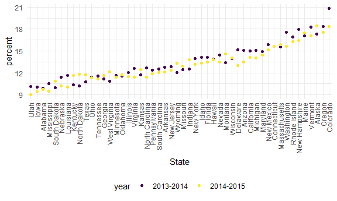
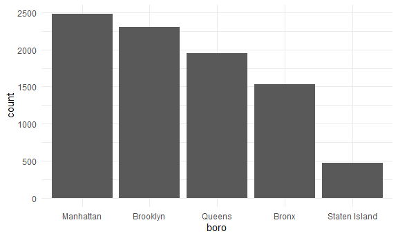

strings_and_factors
================
2022-10-23

## String Vectors

``` r
string_vec = c("my", "name", "is", "jeff")

str_detect(string_vec, "jeff")
```

    ## [1] FALSE FALSE FALSE  TRUE

``` r
str_replace(string_vec, "jeff", "Jeff")
```

    ## [1] "my"   "name" "is"   "Jeff"

``` r
string_vec = c(
  "i think we all rule for participating",
  "i think i have been caught",
  "i think this will be quite fun actually",
  "it will be fun, i think"
  )

str_detect(string_vec, "i think")
```

    ## [1] TRUE TRUE TRUE TRUE

``` r
str_detect(string_vec, "^i think") #starts with i think
```

    ## [1]  TRUE  TRUE  TRUE FALSE

``` r
str_detect(string_vec, "i think$") #ends with i think
```

    ## [1] FALSE FALSE FALSE  TRUE

``` r
string_vec = c(
  "Y'all remember Pres. HW Bush?",
  "I saw a green bush",
  "BBQ and Bushwalking at Molonglo Gorge",
  "BUSH -- LIVE IN CONCERT!!"
  )

str_detect(string_vec,"[Bb]ush") #either upper or lower case b
```

    ## [1]  TRUE  TRUE  TRUE FALSE

``` r
str_detect(string_vec,"[Bb][Uu][Ss][Hh]")
```

    ## [1] TRUE TRUE TRUE TRUE

``` r
string_vec = c(
  '7th inning stretch',
  '1st half soon to begin. Texas won the toss.',
  'she is 5 feet 4 inches tall',
  '3AM - cant sleep :('
  )

str_detect(string_vec, "^[0-9][a-zA-Z]") #any number followed by a either lower or upper letter
```

    ## [1]  TRUE  TRUE FALSE  TRUE

``` r
string_vec = c(
  'Its 7:11 in the evening',
  'want to go to 7-11?',
  'my flight is AA711',
  'NetBios: scanning ip 203.167.114.66'
  )

str_detect(string_vec, "7.11") #anything between 7 and 11, but not 711
```

    ## [1]  TRUE  TRUE FALSE  TRUE

``` r
string_vec = c(
  'The CI is [2, 5]',
  ':-]',
  ':-[',
  'I found the answer on pages [6-7]'
  )

str_detect(string_vec, "\\[") #find [, need \\ because [ is a regex
```

    ## [1]  TRUE FALSE  TRUE  TRUE

``` r
str_detect(string_vec, "\\[[0-9]") #find [ followed by num
```

    ## [1]  TRUE FALSE FALSE  TRUE

## Why factors are weird

``` r
vec_sex = factor(c("male", "male", "female", "female"))
vec_sex #automatically in alphabetical factor level
```

    ## [1] male   male   female female
    ## Levels: female male

``` r
vec_sex = fct_relevel(vec_sex, "male") #make male the first factor level
vec_sex
```

    ## [1] male   male   female female
    ## Levels: male female

## NSDUH

``` r
nsduh_url = "http://samhda.s3-us-gov-west-1.amazonaws.com/s3fs-public/field-uploads/2k15StateFiles/NSDUHsaeShortTermCHG2015.htm"

table_marj = 
  read_html(nsduh_url) %>% 
  html_table() %>% 
  first() %>%
  slice(-1)
```

tidy up the NSDUH data

``` r
marj_df = 
  table_marj %>%
  select(-contains("P value")) %>%
  pivot_longer(
    -State, #pivot anything except for state
    names_to = "age_year",
    values_to = "percent"
  ) %>%
  mutate(
    percent = str_replace(percent, "[a-b]$", ""), #get rid of a,b,c at the end
    percent = as.numeric(percent)
  ) %>%
  separate(age_year, into = c("age", "year"), sep = "\\(") %>% #( is a regex, use \\( to separate at (
  mutate(
    year = str_replace(year, "\\)", "")
  ) %>%
  filter(
    !(State %in% c("Total U.S.", "Northeast", "Midwest", "South", "West", "District of Columbia")) #get rid of rows where state are these
  )
```

``` r
marj_df %>%
  filter(age == "12-17") %>%
  mutate(State = fct_reorder(State, percent)) %>%
  ggplot(aes(x = State, y =percent, color = year)) +
  geom_point() + 
  theme(axis.text.x = element_text(angle = 90, vjust = 0.5, hjust = 1))
```



## Restaurant inspections

``` r
data("rest_inspec")

rest_inspec %>%
  group_by(boro, grade) %>%
  summarize(n_obs = n()) %>%
  pivot_wider(
    names_from = grade,
    values_from = n_obs
  )
```

    ## `summarise()` has grouped output by 'boro'. You can override using the
    ## `.groups` argument.

    ## # A tibble: 6 × 8
    ## # Groups:   boro [6]
    ##   boro              A     B     C `Not Yet Graded`     P     Z  `NA`
    ##   <chr>         <int> <int> <int>            <int> <int> <int> <int>
    ## 1 BRONX         13688  2801   701              200   163   351 16833
    ## 2 BROOKLYN      37449  6651  1684              702   416   977 51930
    ## 3 MANHATTAN     61608 10532  2689              765   508  1237 80615
    ## 4 Missing           4    NA    NA               NA    NA    NA    13
    ## 5 QUEENS        35952  6492  1593              604   331   913 45816
    ## 6 STATEN ISLAND  5215   933   207               85    47   149  6730

``` r
rest_inspec = 
  rest_inspec %>%
  filter(grade %in% c("A", "B", "C"), boro != "Missing") %>%
  mutate(boro = str_to_title(boro)) #Captialize first letter

rest_inspec %>%
  group_by(boro, grade) %>%
  summarize(n_obs = n()) %>%
  pivot_wider(
    names_from = grade,
    values_from = n_obs
  )
```

    ## `summarise()` has grouped output by 'boro'. You can override using the
    ## `.groups` argument.

    ## # A tibble: 5 × 4
    ## # Groups:   boro [5]
    ##   boro              A     B     C
    ##   <chr>         <int> <int> <int>
    ## 1 Bronx         13688  2801   701
    ## 2 Brooklyn      37449  6651  1684
    ## 3 Manhattan     61608 10532  2689
    ## 4 Queens        35952  6492  1593
    ## 5 Staten Island  5215   933   207

Let’s find pizza places

``` r
rest_inspec %>%
  filter(str_detect(dba, "[Pp][Ii][Zz][Zz][Aa]")) %>%
  group_by(boro) %>%
  summarize(n_pizza = n())
```

    ## # A tibble: 5 × 2
    ##   boro          n_pizza
    ##   <chr>           <int>
    ## 1 Bronx            1531
    ## 2 Brooklyn         2305
    ## 3 Manhattan        2479
    ## 4 Queens           1954
    ## 5 Staten Island     471

``` r
rest_inspec %>%
  filter(str_detect(dba, "[Pp][Ii][Zz][Zz][Aa]")) %>%
  mutate(boro = fct_infreq(boro)) %>% #factor in order of frequency of dba
  ggplot(aes(x = boro)) +
  geom_bar()
```



``` r
rest_inspec %>%
  filter(str_detect(dba, "[Pp][Ii][Zz][Zz][Aa]")) %>%
  mutate(
    boro = fct_infreq(boro),
    boro = fct_recode(boro, "The City" = "Manhattan") #rename factor variable
    ) %>% #factor in order of frequency of dba
  ggplot(aes(x = boro)) +
  geom_bar()
```


